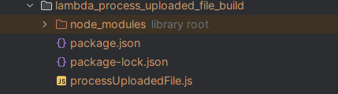

# Instructions for Setting Up Infrastructure with Terraform

## Prerequisites

1. **Terraform** >= 1.3 installed: https://www.terraform.io/downloads.html
2. Access to **AWS configured**
3. **Secret values** are configured saved in Secrets Manager:
   - secrets : `${var.environment}/trip-planner-app/secrets`
     - JWT_SECRET_KEY : TripPlannerAPI JWT secret
     - SPRING_DATASOURCE_USERNAME : RDS database username
     - SPRING_DATASOURCE_PASSWORD : RDS database password
     - SUPER_ADMIN_EMAIL : Email of the super admin user for TripPlannerAPI
     - SUPER_ADMIN_PASSWORD : Password of the super admin user for TripPlannerAPI
     - GEO_DB_RAPID_API_KEY : RapidAPI key for GeoDB
     - API_GW_LOCATIONS_AUTH_SECRET : Secret value of header `x-api-gateway-locations-auth` to request data from LocationsAPI
     - API_GW_IMG_UPLOAD_AUTH_SECRET : Secret value of header `x-api-gateway-img-upload-auth` to request presigned url for image upload
4. Build folder `dist/` is copied in the root of the project, it contains the **compiled frontend application (trip-planner-web-app).**
   - Trip-planner-web-app has been built with correct environment variables set:
     - VITE_API_URL: e.g. `VITE_API_URL=https://staging-alb.epic-trip-planner.com`
     - VITE_API_LOCATIONS: e.g. `VITE_API_LOCATIONS=https://staging.epic-trip-planner.com/locations`
     - VITE_API_UPLOAD_MEDIA: e.g. `VITE_API_UPLOAD_MEDIA=https://staging.epic-trip-planner.com/upload-url`
5. Download the lastest artifact from: https://github.com/lrasata/infra-image-uploader/tree/main/artifacts
   - Unzip the artifact and copy the content inside a build folder such as `lambda_process_uploaded_file_build`
     -  
   - Update `image_uploader.tf` and to refer the build folder:
     - `lambda_process_uploaded_file_dir = "./lambda_process_uploaded_file_build"`
6. Plan and define **IPv4 address range** used by the VPC which has 3 AZs and contains 3 Public subnets and 3 Private Subnets. You will have to provide those values as variables or default values will be applied.


## Getting Started

**1. Clone the repository:**

```bash
git clone https://github.com/lrasata/infra-trip-design-app.git
cd infra-trip-design-app
```

**2. Initialize Terraform:**

````bash
terraform init
````

**3. Fromat configuration:**

````bash
terraform fmt
````

**4. Validate configuration:**

````bash
terraform validate
````

**5. Choose your environment and plan/apply:**

This project uses .tfvars files to handle multiple environments (e.g., dev, staging, prod). Environment-specific values like ALB names, domains, and certificates are defined in these files.

**Example .tfvars files:**

````text
# staging.tfvars
region              = "eu-central-1"
azs                 = ["eu-central-1a", "eu-central-1b", "eu-central-1c"]
vpc_cidr            = "10.0.0.0/16"
public_subnets_ips  = ["10.0.101.0/24", "10.0.102.0/24", "10.0.103.0/24"]
private_subnets_ips = ["10.0.1.0/24", "10.0.2.0/24", "10.0.3.0/24"]

environment               = "staging"
api_locations_domain_name = "staging-api-locations.epic-trip-planner.com"
alb_domain_name           = "staging-alb.epic-trip-planner.com"

cloudfront_domain_name = "staging.epic-trip-planner.com"
allowed_origins        = "https://staging.epic-trip-planner.com" # this cannot be * if allowCredentials is true - rejected by Spring

container_image      = "lrasata/trip-planner-backend-app:1.0.0"
super_admin_fullname = "admin"

API_CITIES_GEO_DB_URL    = "https://wft-geo-db.p.rapidapi.com/v1/geo/cities"
API_COUNTRIES_GEO_DB_URL = "https://wft-geo-db.p.rapidapi.com/v1/geo/countries"
GEO_DB_RAPID_API_HOST    = "wft-geo-db.p.rapidapi.com"

bucket_name = "trip-planner-app-bucket"

backend_certificate_arn    = 
cloudfront_certificate_arn = 

hosted_zone_id = 
````

````text
# prod.tfvars
region = "eu-central-1"

environment               = "prod"
api_locations_domain_name = "api-locations.epic-trip-planner.com"
alb_domain_name           = "alb.epic-trip-planner.com"

cloudfront_domain_name = "epic-trip-planner.com"
allowed_origins        = "https://epic-trip-planner.com" # this cannot be * if allowCredentials is true - rejected by Spring


container_image      = "lrasata/trip-planner-backend-app:1.0.0"
super_admin_fullname = "admin"

API_CITIES_GEO_DB_URL    = "https://wft-geo-db.p.rapidapi.com/v1/geo/cities"
API_COUNTRIES_GEO_DB_URL = "https://wft-geo-db.p.rapidapi.com/v1/geo/countries"
GEO_DB_RAPID_API_HOST    = "wft-geo-db.p.rapidapi.com"

bucket_name = "trip-planner-app-bucket"

backend_certificate_arn    = 
cloudfront_certificate_arn = 

hosted_zone_id = 
````

Plan and apply for a specific environment:

````text
terraform plan -var-file="../common/staging.tfvars" -compact-warnings
terraform apply -var-file="../common/staging.tfvars" -compact-warnings
````

## Notes

- Always review the output of terraform plan before applying changes.
- Keep .terraform.lock.hcl committed for consistent provider versions.

## Destroying Infrastructure

To tear down all resources managed by this project:

````bash
terraform destroy -var-file="staging.tfvars"
````

Replace staging.tfvars with the appropriate tfvars environment file.