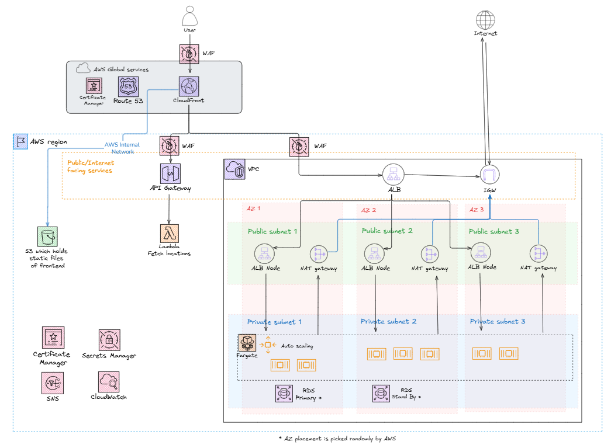
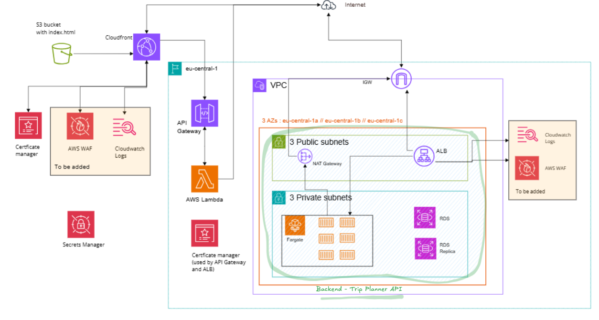
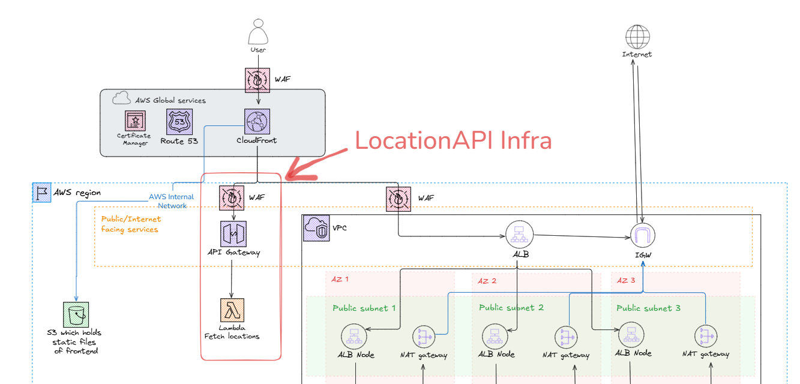
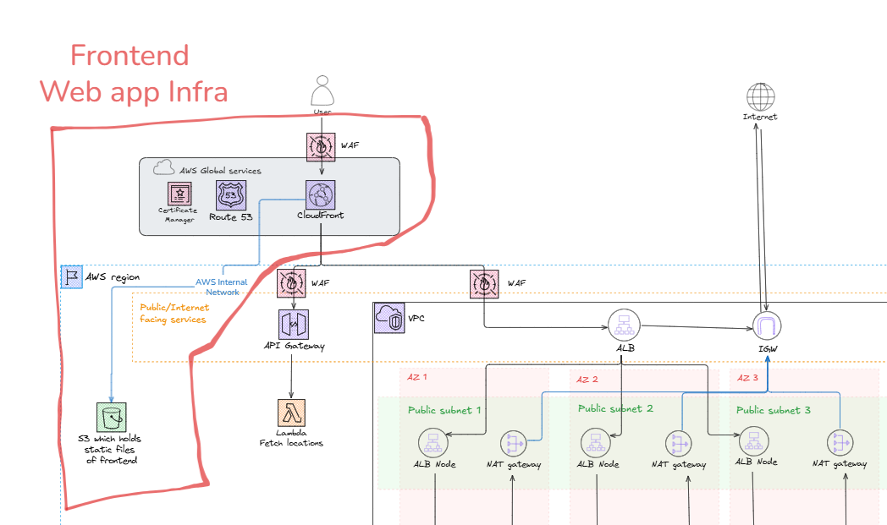

# Trip Planner Infrastructure - managed with Terraform on AWS

# Table of Contents
- [Backend Infrastructure (TripPlannerAPI)](#backend-infrastructure-tripplannerapi)
    - [Overview](#overview)
    - [Key Attributes](#key-attributes)
    - [Gotchas & Lessons Learned](#-gotchas---lessons-learned-sometimes-the-hard-way)
- [Locations API (AWS Lambda + API Gateway)](#locations-api-aws-lambda--api-gateway)
    - [Overview](#overview-1)
    - [Key Attributes](#key-attributes-1)
    - [Environment Variables & Secret API Key](#env-variables-and-secret-api-key)
    - [API Usage](#api-usage)
    - [Gotchas & Notes](#-gotchas---lessons-learned-sometimes-the-hard-way-1)
- [Frontend - Trip Planner Web App](#frontend---trip-planner-web-app)
    - [Overview](#overview-2)
    - [Key Attributes](#key-attributes-2)
        - [Security](#security)
        - [Maintainability](#maintainability)
        - [Scalability](#scalability)
        - [Reliability](#reliability)
    - [Gotchas & Notes](#-gotcha---notes)

# Overview
This repository manages the infrastructure for the Trip Planner application using **Terraform** on **AWS**.

The application includes:
- Backend API (Fargate on ECS + RDS)
- Locations API (Lambda + API Gateway)
- Frontend Web App (S3 + CloudFront)

The architecture is designed to be **robust, secure, and scalable**, leveraging AWS managed services 
to reduce operational overhead.

## Architecture

# Backend infrastructure (TripPlannerAPI)
## Overview
The backend of *Trip Planner* is a **Spring Boot application** which provides CRUD operations for trip data.

## Key Attributes

**Maintainability**
- Runs as **Docker containers on AWS Fargate**, removing the need to manage EC2 instances.

**Scalability**
- ECS Service manages container count automatically as traffic grows.

**Security**
- ECS tasks and RDS run in **private subnets** inside a dedicated VPC.
- **Application Load Balancer (ALB)** routes traffic from public to private subnets.
- **AWS WAF** is tied to the ALB to protect against common web attacks.
- Secrets are stored securely in **AWS Secrets Manager**.

**Monitoring**
- ECS logs are streamed to **AWS CloudWatch Logs** for real-time monitoring and troubleshooting.
- **AWS CloudWatch Alarms + SNS** are set up to monitor :
    - ECS service :
        - Alert when ECS CPU utilization exceeds 90%
        - Alert when ECS Memory utilization exceeds 90%
        - Alert when ECS service has unhealthy tasks
    - RDS database :
        - Alert when RDS free storage space is low
        - Alert when DB has CPU utilization of 0% for 5 minutes - RDS is potentially down
    - ALB :
        - ALB target group has unhealthy hosts
        - Alert when ALB has too many 5xx errors
        - Alert when ALB has high latency (over 2 seconds)

## 🔍 Gotchas
### RDS - Database
- *Database Password is fully managed by RDS*: Check this under DB Instance > Configuration > Master credentials ARN.
    - Even though a custom password is provided, RDS will generate a new password (cannot be overriden) and this **password is automatically rotated by RDS**.
    - On first creation of the database, you will have to manually update the variable for the database password in Secret Manager (the one which ECS task uses to connect to the database)
- *RDS Subnet Requirement:* RDS in production mode requires at least two subnets in different availability zones to 
enable high availability. If you only provide one, deployment will fail silently or behave unexpectedly.
- *Database Connectivity Doesn't Show Up in RDS UI:* The “connected compute resources” in the RDS console is not 
always accurate for ECS or non-EC2 clients. Don’t rely on it to debug connectivity.

### ALB
- *Target Group Unhealthy == No Traffic:* If your ECS container is running but your ALB Target Group is showing “unhealthy” targets, the ALB will not forward traffic. This is typically caused by:
    - Wrong health check path (e.g., / vs /actuator/health)
    - Port mismatch (container not listening on the expected port)
    - Network/security group misconfig
- *504 Gateway Timeout ≠ Network Issue:* A 504 from the Load Balancer often just means the ECS container failed to start up fully or didn't bind to the correct port (e.g., 8080). Check that your application is actually listening on the port expected by the ALB Target Group.

### ECS
- *ECS Container Start = Slower Than Expected:* Don't expect ECS Fargate to start containers instantly. Between image pulling, network setup, and health checks, startup can take 1–2+ minutes.

### Secrets Manager
- *SecretsManager ≠ Instant Fix:* Referencing secrets inside ECS task definitions must follow exact syntax (valueFrom must use the full ARN or proper SecretsManager parameter name). Mismatched names will cause cryptic errors.

### Terraform
- *Security Group Deletion Blocked:* Terraform cannot delete a security group if it's still attached to active resources (like ECS, ALB, or RDS) — even if the plan shows successful validation. This can stall terraform destroy for several minutes.
- *Terraform Ordering Matters:* Ensure ECS services depend on RDS or networking modules (depends_on), otherwise containers may try to start before the DB is available.

# Locations API

## Overview

[Trip planner web app](https://github.com/lrasata/trip-planner-web-app) is using [Geo DB API](https://rapidapi.com/wirefreethought/api/geodb-cities)
to fetch data related to cities and countries.

To be able to deploy [Trip planner web app](https://github.com/lrasata/trip-planner-web-app)
(React + TypeScript web app) securely on S3 + CloudFront, it must provide a secret `API_KEY` in the header of an authenticated request.

But the challenge is to inject secrets securely in a React + Vite app, secrets must be separated from
the frontend and a backend must be used to access them. **There is no secure way to keep a secret in a public browser app.**

`Locations API` has been created to provide an API endpoint to call for the frontend without requiring any secrets. 
Those components provide a secure serverless API for accessing location data, powered by AWS Lambda and API Gateway.

> Refer to the [Locations API repository](https://github.com/lrasata/locations-api) for full details

# Frontend - Trip planner web app

## Overview
This part of the infrastructure sets up an AWS **CloudFront distribution** to serve a **Single Page Application (SPA)** 
from an **S3 bucket**, using **Lambda@Edge** to handle routing for client-side routes. It ensures that all SPA routes 
return `index.html` while keeping the S3 bucket secure and private.

## Key Attributes
**Security**
- S3 bucket blocks all public access.
- CloudFront Origin Access Control (OAC) ensures only CloudFront can access the S3 bucket.
- Lambda@Edge uses minimal IAM permissions via `AWSLambdaBasicExecutionRole`.
- Custom header : `API_GW_LOCATIONS_AUTH_SECRET` is injected by CloudFront to securely communicate with `LocationsAPI`.

**Maintainability**
- Lambda@Edge centralizes route handling for SPA, reducing manual S3 configuration.

**Scalability**
- **CloudFront CDN** caches content globally, reducing latency and improving user experience.
- Static content served from S3 scales automatically with traffic.
- Lambda@Edge executes at edge locations, distributing the load worldwide.

**Reliability**
- CloudFront + S3 + Lambda@Edge provides high availability and low downtime.
- HTTPS is enabled with ACM certificates, ensuring secure and reliable access.

**Monitoring**
- **AWS CloudWatch Alarms + SNS** are set up to monitor :
    - Cloudfront distribution :
        - Alert when CloudFront has too many 5xx errors

## 🔎 Gotchas
- Build the frontend with `npm run build` and sync the `./dist` folder to S3 before deployment.
- Lambda@Edge must be deployed in `us-east-1`, the only region supporting it.
- ACM certificates for HTTPS for CloudFront must also be requested in `us-east-1`.
- SPA must use the CloudFront URL as the API endpoint to allow CloudFront to inject the required custom header for API Gateway:
    - Correct: `VITE_API_LOCATIONS=https://epic-trip-planner.com/locations`
    - Incorrect: `VITE_API_LOCATIONS=https://api-locations.epic-trip-planner.com/locations` - 
hitting the API Gateway directly will not work as it does not inject the custom header required by the API Gateway.
