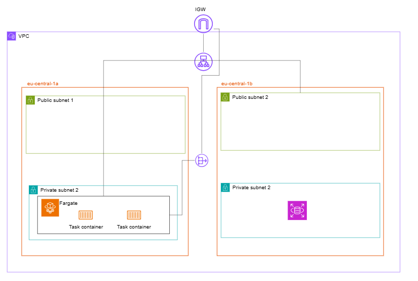

# Infra-trip-design-app | Terraform project 🚧

> **Status**: 🚧 in construction

## Overview

This Terraform project manages the infrastructure of the backend
for [TripDesignAPI : a Java Spring Boot application](https://github.com/lrasata/tripPlannerAPI).

It provisions resources such as **AWS VPC, ALB, Fargate, RDS, etc...**.

### TripDesignAPI backend - Infrastructure

The backend of TripDesignAPI is a Spring Boot application serves as the backend counterpart to the [Trip Planner Web App](https://github.com/lrasata/trip-planner-web-app).
It provides endpoints to create, read, update, and delete trip data, enabling seamless trip planning and management.

#### Infrastructure Overview
- **Containerization & Orchestration:** The backend runs as Docker containers deployed on AWS Fargate, a serverless compute engine for containers. This eliminates the need to manage EC2 instances and simplifies scaling and maintenance.
- **Database:** A PostgreSQL database is provisioned and managed by AWS RDS (Relational Database Service). This managed service provides automated backups, patching, and high availability features, ensuring reliable storage of trip and user data.
- **Networking & Security:** The ECS tasks (Fargate containers) run inside a private subnet within a dedicated VPC, separate from the subnet where the RDS database resides. This segmentation enhances security and isolates compute resources.
Communication between ECS tasks and the RDS instance is secured via tightly scoped security groups, allowing only necessary traffic on the PostgreSQL port (5432).
- **Scalability & High Availability:** The infrastructure is designed to scale out as demand increases, with ECS Service managing the lifecycle and count of task containers. The RDS database spans multiple availability zones through subnet groups to provide resilience and minimize downtime.
- **Secrets Management:** Database credentials and sensitive configuration values are securely stored and accessed via AWS Secrets Manager, reducing the risk of credential leaks and simplifying secret rotation.
- **Observability:** Application logs from ECS tasks are streamed to AWS CloudWatch Logs, enabling real-time monitoring, troubleshooting, and alerting.

This architecture offers a robust, secure, and scalable backend environment to power the Trip Design application, taking full advantage of AWS managed services to reduce operational overhead and improve reliability.




---

## 🔍 Gotcha -  what I have learned
- ✅ *RDS Password Surprise:* Always provide a strong, non-trivial password to AWS RDS — even for testing. A weak password like postgres may be silently rejected by AWS, and RDS will auto-generate a new password, saving it in AWS Secrets Manager. Check this under DB Instance > Configuration > Master credentials ARN.
  - In this case you may manually update secrets password provided to the ECS Service to align with the AWS RDS generated password.
- 🛑 *Security Group Deletion Blocked:* Terraform cannot delete a security group if it's still attached to active resources (like ECS, ALB, or RDS) — even if the plan shows successful validation. This can stall terraform destroy for several minutes.

- 🌐 *RDS Subnet Requirement:* AWS RDS in production mode requires at least two subnets in different availability zones to enable high availability. If you only provide one, deployment will fail silently or behave unexpectedly.

- 🕳️ *504 Gateway Timeout ≠ Network Issue:* A 504 from the Load Balancer often just means the ECS container failed to start up fully or didn't bind to the correct port (e.g., 8080). Check that your application is actually listening on the port expected by the ALB Target Group.

- 🧱 *Target Group Unhealthy == No Traffic:* If your ECS container is running but your ALB Target Group is showing “unhealthy” targets, the ALB will not forward traffic. This is typically caused by:
  - Wrong health check path (e.g., / vs /actuator/health)
  - Port mismatch (container not listening on the expected port)
  - Network/security group misconfig

- 🐢 E*CS Container Start = Slower Than Expected:* Don't expect ECS Fargate to start containers instantly. Between image pulling, network setup, and health checks, startup can take 1–2+ minutes.

- 🔐 *SecretsManager ≠ Instant Fix:* Referencing secrets inside ECS task definitions must follow exact syntax (valueFrom must use the full ARN or proper SecretsManager parameter name). Mismatched names will cause cryptic errors.

- 🧠 *Database Connectivity Doesn't Show Up in RDS UI:* The “connected compute resources” in the RDS console is not always accurate for ECS or non-EC2 clients. Don’t rely on it to debug connectivity.

- 🔄 *Terraform Ordering Matters:* Ensure ECS services depend on RDS or networking modules (depends_on), otherwise containers may try to start before the DB is available.

---

## Prerequisites

- Terraform >= 1.3 installed: https://www.terraform.io/downloads.html
- Access to AWS configured

## Getting Started

1. Clone the repository:

```bash
git clone https://github.com/lrasata/infra-trip-design-app.git
cd infra-trip-design-app
```

2. Initialize Terraform:

````bash
terraform init
````

3. Fromat configuration:

````bash
terraform fmt
````

4. Validate configuration:

````bash
terraform validate
````

4. Review changes:

````bash
terraform plan
````

5. Apply infrastructure:

````bash
terraform apply
````

## Important Files

````text
  infra-trip-design-app/
  ├── provider.tf                   # Providers and general setup
  ├── network.tf                    # Vpc, Subnets
  ├── security.tf                   # security groups
  ├── compute.tf                    # ECS instances
  ├── database.tf                   # RDS instances
  ├── variables.tf                  # Input variables
  ├── outputs.tf                    # Output values
  ├── .terraform.lock.hcl           # provider dependency lock 
````

## Notes

- Always review the output of terraform plan before applying changes.
- Keep .terraform.lock.hcl committed for consistent provider versions.

## Destroying Infrastructure

To tear down all resources managed by this project:

````bash
terraform destroy
````