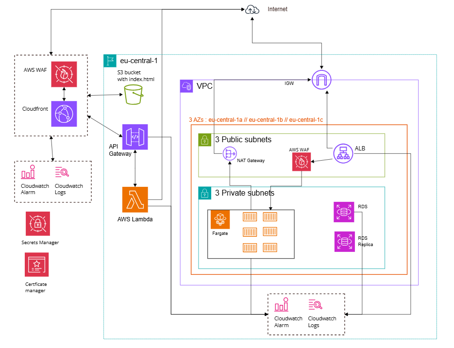
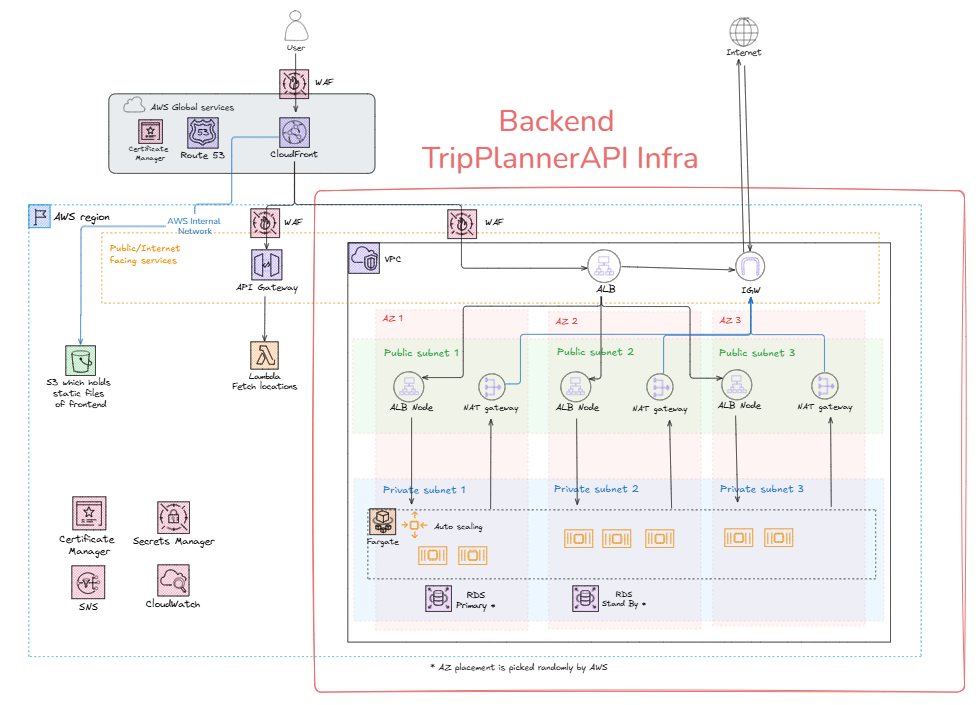

# Trip Planner Infrastructure - managed with Terraform on AWS
  


# Table of Contents
- [Backend Infrastructure (TripPlannerAPI)](#backend-infrastructure-of-tripplannerapi)
  - [Infrastructure Overview](#infrastructure-overview)
  - [Gotchas & Lessons Learned](#-gotcha---what-i-have-learned)
- [Locations API (AWS Lambda + API Gateway)](#locations-api-aws-lambda--api-gateway)
  - [Infrastructure Overview](#infrastructure-overview-1)
  - [Environment Variables & Secrets](#env-variables-and-secret-api-key)
  - [API Usage](#api-usage)
  - [Gotchas & Notes](#-gotcha---notes)
- [Frontend - Trip Planner Web App](#frontend---trip-planner-web-app)
  - [Stack](#stack)
  - [Security](#security)
  - [Gotchas & Notes](#-gotcha---notes-1)
  
# Backend infrastructure of TripPlannerAPI
> Deployment of Containerised Web App to AWS Fargate and RDS database with Terraform

The backend is a Spring Boot application serves as the backend counterpart to the [Trip Planner Web App](https://github.com/lrasata/trip-planner-web-app).
It provides endpoints to create, read, update, and delete trip data, enabling seamless trip planning and management.



#### Infrastructure Overview
- **Containerization & Orchestration:** The backend runs as Docker containers deployed on AWS Fargate, a serverless compute engine for containers. This eliminates the need to manage EC2 instances and simplifies scaling and maintenance.
- **Database:** A PostgreSQL database is provisioned and managed by AWS RDS (Relational Database Service). This managed service provides automated backups, patching, and high availability features, ensuring reliable storage of trip and user data.
- **Networking & Security:** The ECS tasks (Fargate containers) run inside a private subnet within a dedicated VPC, separate from the subnet where the RDS database resides. This segmentation enhances security and isolates compute resources.
  Communication between ECS tasks and the RDS instance is secured via tightly scoped security groups, allowing only necessary traffic on the PostgreSQL port (5432).
- **Scalability & High Availability:** The infrastructure is designed to scale out as demand increases, with ECS Service managing the lifecycle and count of task containers. The RDS database spans multiple availability zones through subnet groups to provide resilience and minimize downtime.
- **Secrets Management:** Database credentials and sensitive configuration values are securely stored and accessed via AWS Secrets Manager, reducing the risk of credential leaks and simplifying secret rotation.
- **Observability:** Application logs from ECS tasks are streamed to AWS CloudWatch Logs, enabling real-time monitoring, troubleshooting, and alerting.

This architecture offers a robust, secure, and scalable backend environment to power the Trip Planner application, taking full advantage of AWS managed services to reduce operational overhead and improve reliability.

## 🔍 Gotcha -  what I have learned
### RDS - Database
- ✅ *RDS Password Surprise:* Always provide a strong, non-trivial password to AWS RDS — even for testing. A weak password like postgres may be silently rejected by AWS, and RDS will auto-generate a new password, saving it in AWS Secrets Manager. Check this under DB Instance > Configuration > Master credentials ARN.
    - In this case you may manually update secrets password provided to the ECS Service to align with the AWS RDS generated password.
- 🌐 *RDS Subnet Requirement:* AWS RDS in production mode requires at least two subnets in different availability zones to enable high availability. If you only provide one, deployment will fail silently or behave unexpectedly.
- 🧠 *Database Connectivity Doesn't Show Up in RDS UI:* The “connected compute resources” in the RDS console is not always accurate for ECS or non-EC2 clients. Don’t rely on it to debug connectivity.

### ALB
- 🧱 *Target Group Unhealthy == No Traffic:* If your ECS container is running but your ALB Target Group is showing “unhealthy” targets, the ALB will not forward traffic. This is typically caused by:
    - Wrong health check path (e.g., / vs /actuator/health)
    - Port mismatch (container not listening on the expected port)
    - Network/security group misconfig
- 🕳️ *504 Gateway Timeout ≠ Network Issue:* A 504 from the Load Balancer often just means the ECS container failed to start up fully or didn't bind to the correct port (e.g., 8080). Check that your application is actually listening on the port expected by the ALB Target Group.

### ECS
- 🐢 *ECS Container Start = Slower Than Expected:* Don't expect ECS Fargate to start containers instantly. Between image pulling, network setup, and health checks, startup can take 1–2+ minutes.

### Secrets Manager
- 🔐 *SecretsManager ≠ Instant Fix:* Referencing secrets inside ECS task definitions must follow exact syntax (valueFrom must use the full ARN or proper SecretsManager parameter name). Mismatched names will cause cryptic errors.

### Terraform
- 🛑 *Security Group Deletion Blocked:* Terraform cannot delete a security group if it's still attached to active resources (like ECS, ALB, or RDS) — even if the plan shows successful validation. This can stall terraform destroy for several minutes.
- 🔄 *Terraform Ordering Matters:* Ensure ECS services depend on RDS or networking modules (depends_on), otherwise containers may try to start before the DB is available.

## TODO tasks
- [ ] Integrate 3 different envs : `dev | stage | prod`
- [ ] Add firewall AWS WAF
- [ ] Enable Auto-scaling on AWS Fargate
- [ ] Audit performance of TripPlannerAPI and leverage caching strategy
- [ ] For monitoring purpose on TripPlannerAPI, deploy [Monitoring services](https://github.com/lrasata/monitoring-services) built with Prometheus and Grafana --> define value

# Locations API (AWS Lambda + API Gateway)
Those components provide a secure serverless API for accessing location data, powered by AWS Lambda and API Gateway.


### Infrastructure Overview

[Trip planner web app](https://github.com/lrasata/trip-planner-web-app) is using [Geo DB API](https://rapidapi.com/wirefreethought/api/geodb-cities)
to fetch data related to cities and countries.

To be able to deploy [Trip planner web app](https://github.com/lrasata/trip-planner-web-app)
(React + TypeScript web app) in a secure way on S3 + CloudFront, it must provide a secret `API_KEY` in the header of an authenticated request.

But the challenge is, to inject secrets securely in a React + Vite app, secrets must be separated from
the frontend and a backend must be used to access them. **There is no secure way to keep a secret in a public browser app.**

> ✅ Locations API has been created to provide an API endpoint to call for the frontend without requiring any secrets.

## Stack

- **Runtime**: Node.js (Express-style Lambda)
- **Infrastructure**: AWS Lambda, API Gateway (REST), Terraform
- **Secrets**: AWS Lambda environment variables
- **Security**: API Gateway integration

## Env variables and secret API key

**Local development**

In `lambda/hadnler.js`, the secret (e.g., API key) should be passed via environment variables in Terraform:

```js
Authorization: 'Bearer ${process.env.GEO_DB_RAPID_API_KEY}'
```

List of env variables :
````text
API_CITIES_GEO_DB_URL=
API_COUNTRIES_GEO_DB_URL=
GEO_DB_RAPID_API_HOST=
GEO_DB_RAPID_API_KEY=
````

**For deployed env on AWS**

Secrets has to be defined in AWS Secrets Manager inside : `prod/trip-planner-app/secrets` as configure in Terraform file.

Environment variables has to be defined in `terraform.tfvars`

## API Usage

### GET `/locations?dataType=city&namePrefix=Paris`

Query parameters :
- **dataType**: `city` or `country`
- **namePrefix**: the `string` to look up to perform matching on location name
- **countryCode**: country code

```bash
curl https://<your-api-id>.execute-api.<region>.amazonaws.com/prod/locations?dataType=city&namePrefix=Paris
```

## 🔎 Gotcha - Notes
- OPTIONS method should stay with CORS headers in API Gateway.
  - API Gateway can automatically respond to preflight OPTIONS requests (which browsers send to check permissions) without invoking your Lambda — this reduces Lambda invocations and saves cost.
- For GET requests (or any non-OPTIONS request), Lambda function must return the CORS headers.
- No need to set CORS headers on API Gateway for GET/POST when using `Lambda proxy integration`.
  - But ensure your Lambda function handles CORS headers for all responses (including errors).

> 💡 Let API Gateway manage CORS whenever possible 💡
> - API Gateway is designed to handle cross-origin resource sharing (CORS) settings centrally.
> - API Gateway can add necessary CORS headers on the response for all your API calls consistently.
> - Keep Lambda code simpler and focused on business logic.

# Frontend - Trip planner web app

> Deployment of CloudFront + S3 + Lambda@Edge for SPA Hosting


This part of the infra sets up an AWS **CloudFront distribution** to serve a **Single Page Application (SPA)** from an **S3 bucket**, using **Lambda@Edge** to handle routing for client-side routes. It ensures that all SPA routes return `index.html` while keeping the S3 bucket secure and private.

## Stack

- **Lambda@Edge:** Handles viewer requests to serve `index.html` for routes that do not exist in S3.
- **CloudFront CDN:** Provides caching, HTTPS, and custom domain support.
- **S3 Bucket:** Private bucket with versioning enabled for static SPA files.
- **Secure Access:** Only CloudFront can access the S3 bucket via Origin Access Control (OAC).

## Security
- S3 bucket blocks all public access.
- CloudFront Origin Access Control ensures only CloudFront can access the bucket.
- Lambda@Edge uses minimal IAM permissions via AWSLambdaBasicExecutionRole.

## 🔎 Gotcha - Notes
- Frontend app must be built with `npm run build` before deploying adn /dist folder must de sync with S3 bucket.
- Terraform handles static file upload from ./dist
- Lambda@Edge must be deployed in `us-east-1` region, as this is the only region that supports Lambda@Edge.
- Certificates must be requested in `us-east-1` for CloudFront to work with HTTPS
-  Frontend app must use the cloudfront URL as the API endpoint, not the API Gateway URL. This is because only CloudFront is able to inject the Custom Header `X-Custom-Auth` with the correct secret value recognised by the API Gateway.
   - in this case : `VITE_API_LOCATIONS=https://epic-trip-planner.com/locations`
   - NOT : `VITE_API_LOCATIONS=https://api-locations.epic-trip-planner.com/locations` - hitting the API Gateway directly will not work as it does not inject the custom header.

